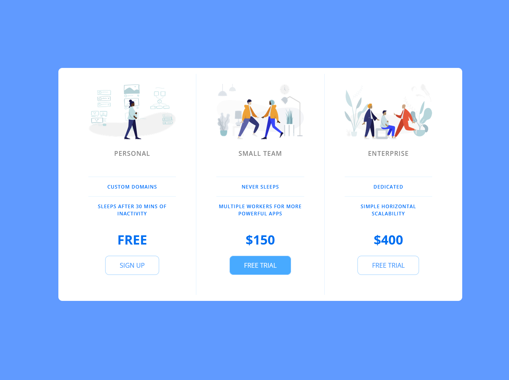

# Pricing Panel

**Link to project:** [Here](https://selt0.github.io/pricePanel/)

A simple price panel using plain HTML and CSS

A simple project to remind myself that websites are built off small compenents. Each component has content wrapped in containers. You style the container, then move to styling the content inside the container. Focus on one task at a time. Break down the project into small components.

## Lessons Learned:

Built using mobile-first design. Not so different from starting with desktop design. It's a matter of preference, at the end of the day, both practices make a responsive design.
